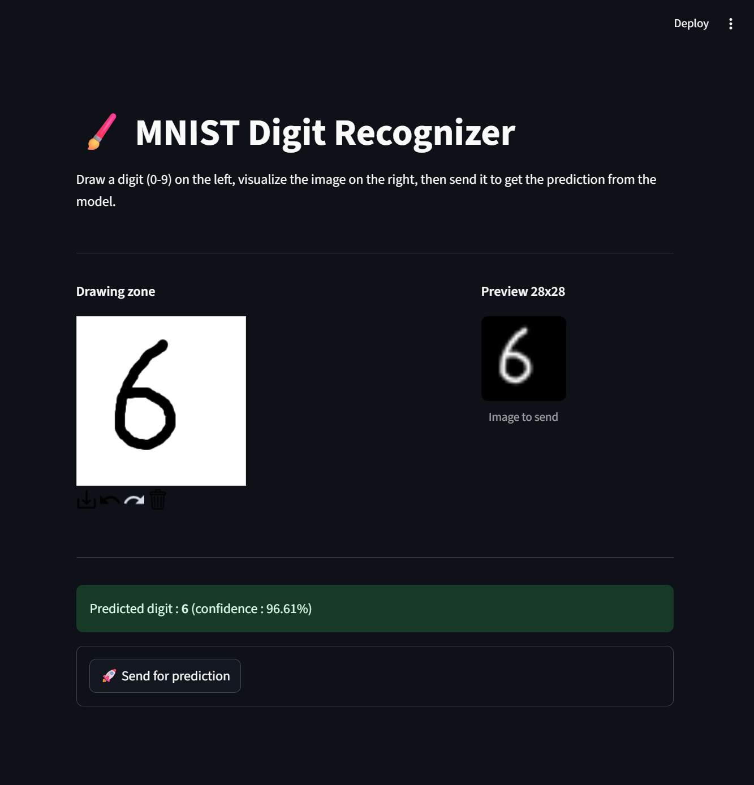

# Rapport du TP - Machine Learning

>Ce TP a été réalisé avec [Alan Garnier](https://github.com/AlanGarnier)

## Objectif du TP

Entraîner un modèle de deep learning sur le jeu de données MNIST, créer une route FastAPI pour exposer la prédiction, et développer une interface simple permettant d’écrire un chiffre à la main pour obtenir une prédiction du modèle.

## Structure du projet

Le projet est organisé de la manière suivante, en suivant les règles du MLOPS de niveau 2 :

- **notebook/load_mnist.py** : Script qui sert à charger le dataset MNIST et à afficher une image contenant un exemple de chaque chiffre de 0 à 9. Il permet de visualiser un petit aperçu des données utilisées pour l'entraînement.
- **src/**
  - **app/** : Contient les scripts principaux de l'application. `app.py` correspond à l'interface de l'application réalisée avec Streamlit, et `main.py` correspond au script backend avec la route de prédiction (`api/v1/predict`) réalisé avec FastAPI.
  - **model/** : Contient la définition du modèle `ConvNet` (`model.py`) et le script d'entraînement (`train.py`).
- **model/mnist-0.0.1.pt** : Contient le modèle ConvNet entraîné.
- **docker/** : Contient la configuration pour la dockerisation du projet, avec des sous-dossiers pour le front et le back, chacun disposant de son propre `Dockerfile`.
- **data/** : données MNIST utilisées pour entraîner le model.
- **requirements.txt** : Liste des dépendances Python nécessaires pour le projet (`torch, streamlit, fastapi, etc.`).

## Récap de la structure MLOPS de niveau 2

```
├── notebook/     <- fichiers exploratoires
├── src/
│   ├── model/    <- Code d'entraînement du modèle
│   └── app/      <- application streamlit et route api
└── model/        <- Modèle ConvNet
```

## Apperçu de l'interface de l'application



